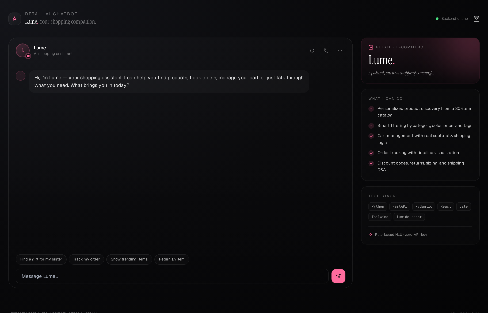
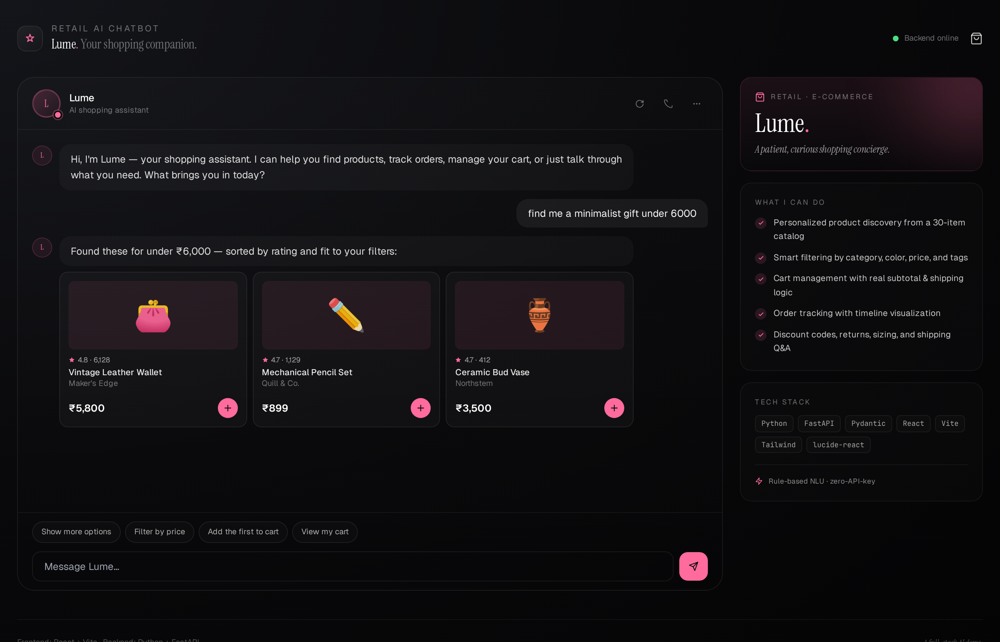
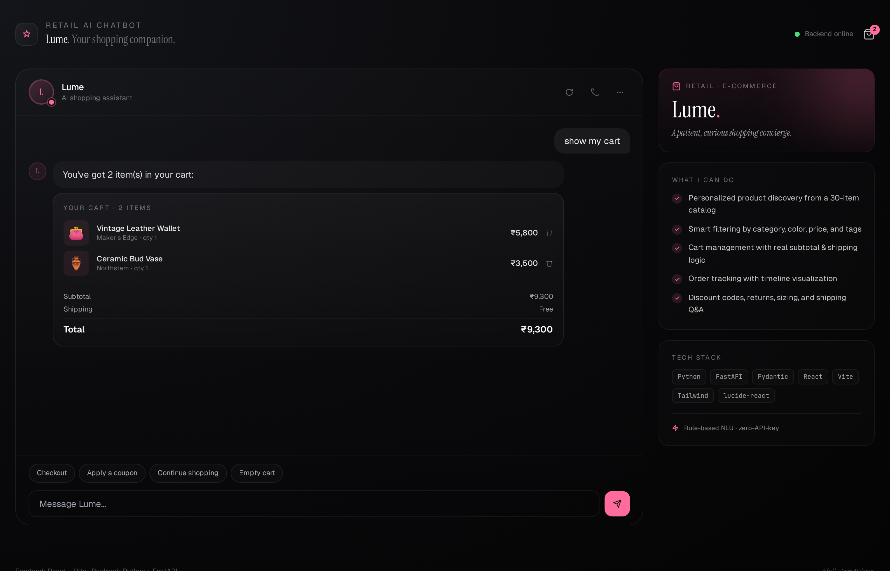
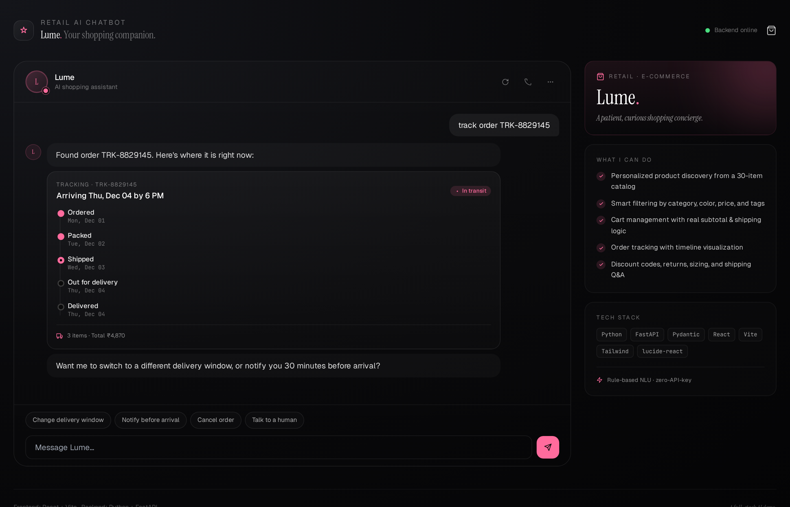
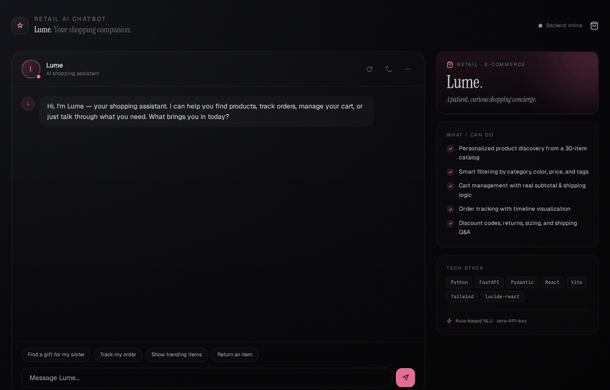

# DRC Retail AI Chatbot

> A full-stack conversational AI shopping assistant — **Python FastAPI backend** + **React frontend**.

[](https://github.com/drcinfotech/Retail-AI-Chatbot/actions/workflows/ci.yml)
[](LICENSE)
[](https://www.python.org/)
[](https://nodejs.org/)
[](https://fastapi.tiangolo.com/)
[](https://react.dev/)
[](https://tailwindcss.com/)

A production-shaped demo of an AI chatbot built specifically for retail and e-commerce. The bot, *DRC*, can find products with natural-language filters, manage a real cart, track orders with a visual timeline, apply discount codes, handle returns, and gracefully fall back when confused. Everything runs locally with **zero external API keys**.

## 📸 Preview

<!-- Drop your captured screenshots into docs/screenshots/ and uncomment these.
     See docs/screenshots/README.md for capture guidance. -->

<!--


<details>
<summary>More screenshots</summary>





</details>


-->

   

   <details>
   <summary>More screenshots</summary>

   
   
   

   </details>

   

---

## ✨ What it does

| Capability | Example user message | What happens |
|---|---|---|
| **Personalized search** | *"find me a minimalist gift under ₹6,000"* | Filters by tag + price, returns 3 ranked products with image, brand, rating |
| **Smart add-to-cart** | *"add the first one to my cart"* | Uses conversation memory to know which product *"the first one"* refers to |
| **Cart management** | *"show my cart"* / *"checkout"* | Real subtotal, free-shipping threshold logic, item removal |
| **Order tracking** | *"track order TRK-8829145"* | Renders a timeline with current shipping status |
| **Discount codes** | *"any coupons?"* | Returns active promos as styled promo cards |
| **Returns** | *"how do I return something?"* | Explains the policy + offers to start a return |
| **Shipping / sizing** | *"how long does shipping take?"* | Direct, informative answers |
| **Talk to human** | *"connect me to an agent"* | Offers wait/email/callback options |
| **Greeting & goodbye** | *"hi"* / *"thanks bye"* | Friendly bookends |
| **Graceful fallback** | unrecognized message | Shows trending items + recovery suggestions |

Each response can include **rich blocks** — text, product grids, cart cards, order timelines, or promo codes — rendered as distinct React components.

---

## 🏗️ Architecture

```
┌─────────────────────────────┐         ┌─────────────────────────────┐
│  React Frontend             │         │  Python FastAPI Backend     │
│  ───────────────            │  HTTP   │  ────────────────────        │
│  • Chat UI                  │ ──────► │  • Intent classifier (regex │
│  • Rich block rendering     │  /chat  │    + keyword scoring)       │
│  • Cart state               │ ◄────── │  • Entity extraction        │
│  • Session-aware            │  JSON   │  • Product catalog (30 SKUs)│
│  • Vite proxy → :8000       │         │  • In-memory sessions       │
│                             │         │  • CORS-enabled REST API    │
└─────────────────────────────┘         └─────────────────────────────┘
        Port 5173                                  Port 8000
```

**Why rule-based NLU?** No API key, no cost, deterministic and explainable, easy to extend. The classifier scores every intent against the user's message using regex patterns (high confidence) and keyword hits (cumulative). For production you can swap `app/chatbot.py` to call an LLM and translate its output into the same Block schema — the frontend doesn't change.

---

## 🚀 Quick Start

### Option A — Docker (fastest, one command)

```bash
docker compose up --build
```

Then open **http://localhost:5173** in your browser. The backend's interactive API docs live at **http://localhost:8000/docs**. Stop with `Ctrl+C` or `docker compose down`.

This builds both containers, starts them, wires up the internal network, and runs healthchecks. You need only [Docker Desktop](https://www.docker.com/products/docker-desktop/) installed.

### Option B — Manual (two terminals)

If you'd rather run the stack natively for hot-reload dev work, you need **two terminals** open — one for the Python backend, one for the React frontend.

### Prerequisites
- **Python 3.10+** ([python.org](https://www.python.org/))
- **Node.js 18+** ([nodejs.org](https://nodejs.org/))

### Terminal 1 — Backend (Python)

```bash
cd backend

# Create a virtual environment (recommended)
python -m venv venv

# Activate it
# macOS/Linux:
source venv/bin/activate
# Windows (PowerShell):
.\venv\Scripts\Activate.ps1
# Windows (cmd):
venv\Scripts\activate.bat

# Install dependencies
pip install -r requirements.txt

# Start the API server
uvicorn main:app --reload --port 8000
```

You should see:
```
INFO:     Uvicorn running on http://127.0.0.1:8000
INFO:     Application startup complete.
```

Visit **http://127.0.0.1:8000/docs** to see the auto-generated interactive API documentation (Swagger UI).

### Terminal 2 — Frontend (React)

```bash
cd frontend

# Install dependencies
npm install

# Start the dev server
npm run dev
```

The browser opens automatically to **http://localhost:5173**. Vite is configured to proxy `/api/*` calls to the backend, so as long as both servers run on their default ports, you're set.

---

## 🗂️ Project Structure

```
retail-ai-chatbot/
├── README.md                    ← You are here
├── CONTRIBUTING.md              Dev setup + style guide
├── LICENSE                      MIT
├── .gitignore
├── .dockerignore
├── docker-compose.yml           One-command full-stack launch
│
├── .github/
│   ├── workflows/ci.yml         GitHub Actions — tests + build matrix
│   ├── ISSUE_TEMPLATE/          Bug report + feature request templates
│   └── PULL_REQUEST_TEMPLATE.md
│
├── docs/
│   └── screenshots/             Drop preview images here
│
├── backend/                     ← Python FastAPI server
│   ├── Dockerfile               Production-ready container
│   ├── .env.example             Configurable settings
│   ├── main.py                 Entry point + routes
│   ├── requirements.txt        Dependencies
│   ├── test_chatbot.py         21 smoke tests
│   ├── app/
│   │   ├── __init__.py
│   │   ├── chatbot.py          ChatbotEngine + intent handlers
│   │   ├── intents.py          Intent classifier (regex + keyword scoring)
│   │   ├── catalog.py          Product search/filter logic
│   │   ├── sessions.py         In-memory cart & conversation state
│   │   └── models.py           Pydantic request/response schemas
│   └── data/
│       └── products.json       30-product catalog (jewelry, clothing,
│                               electronics, beauty, home, etc.)
│
└── frontend/                   ← React + Vite + Tailwind
    ├── Dockerfile              Multi-stage: build with Node, serve with nginx
    ├── nginx.conf              SPA fallback + /api proxy to backend
    ├── .env.example            VITE_API_BASE for production deploys
    ├── index.html
    ├── package.json
    ├── vite.config.js          Dev: /api → :8000 proxy
    ├── tailwind.config.js
    ├── postcss.config.js
    ├── public/favicon.svg
    └── src/
        ├── main.jsx            React entry
        ├── App.jsx             Main chat UI
        ├── api.js              fetch() wrapper for the backend
        ├── index.css           Tailwind + custom utilities
        └── components/
            └── Blocks.jsx      Renderers for each block type
```

---

## 🧠 How the chatbot thinks

When a user sends a message:

1. **Classify intent** — `app/intents.py` checks the message against every intent's regex patterns (worth 2.0 each) and keywords (worth 0.6 each). Top scorer wins; confidence = top / (top + second).
2. **Extract entities** — categories, colors, gender, price ceilings, order IDs, and lifestyle tags are pulled with regex.
3. **Dispatch to a handler** — `app/chatbot.py` routes the intent to a handler that builds a list of response blocks and follow-up suggestions.
4. **Update session** — the in-memory store remembers the last products shown (so "*add the first one*" knows what to add) and the cart contents.
5. **Return JSON** — the frontend renders each block with a component (`Blocks.jsx`) keyed by `block.type`.

The whole pipeline runs in <5 ms on a laptop. Adding a new intent is ~5 lines.

---

## 🛠️ Adding a new intent

Three places to edit:

**1. `backend/app/intents.py`** — append to `INTENTS`:
```python
IntentSpec(
    "wishlist_add",
    patterns=[r"\b(save|wishlist|favorite)\s+.+\b(for later)?\b"],
    keywords=["wishlist", "save", "favorite"],
),
```

**2. `backend/app/chatbot.py`** — add a handler and register it:
```python
def _handle_wishlist(_c, session):
    return ([_build_text("Saved! I'll let you know if it drops in price.")],
            ["Show my wishlist", "Browse trending"])

# in ChatbotEngine.respond:
handler_map["wishlist_add"] = lambda: _handle_wishlist(c, session)
```

**3. (Optional) `frontend/src/components/Blocks.jsx`** — only if you're adding a new *block type*. Existing intents that return text/products/cart need no frontend changes.

---

## 📡 API Reference

The backend auto-publishes OpenAPI docs at **`/docs`** when running.

### `POST /chat`
Send a message, get a structured response.
```json
// Request
{ "message": "find me a gift under 5000", "session_id": "optional" }

// Response
{
  "session_id": "kJ8x2pQrL...",
  "intent": "gift_help",
  "confidence": 0.92,
  "blocks": [
    { "type": "text", "content": "Gifting is one of my favorite things..." },
    { "type": "products", "items": [ ... ] }
  ],
  "suggestions": ["Wrap as a gift", "Show more", "Under ₹2,000", "Add the first one"]
}
```

### `GET /products?category=jewelry&price_max=15000&limit=10`
Browse the catalog directly.

### `POST /cart/add`, `POST /cart/remove`, `GET /cart?session_id=...`
Programmatic cart operations (e.g. from a product card's +button).

### `GET /health`
Liveness probe — returns `{"status": "ok", "products": 30}`.

---

## 🧪 Testing the backend manually

```bash
# Health check
curl http://127.0.0.1:8000/health

# Send a chat message
curl -X POST http://127.0.0.1:8000/chat \
  -H "Content-Type: application/json" \
  -d '{"message": "find me minimalist jewelry under 15000"}'

# Browse the catalog
curl 'http://127.0.0.1:8000/products?category=jewelry&limit=5'
```

---

## 📦 Production Notes

This is a demo. For real deployment, consider:

- **Persistence**: swap `app/sessions.py` from in-memory dict → Redis or Postgres.
- **LLM integration**: replace the rule-based classifier with an LLM call (OpenAI, Anthropic, etc.) — convert its output into the same block schema and the frontend stays unchanged.
- **Authentication**: add a real auth layer; session IDs are unsigned tokens.
- **CORS**: tighten `allow_origins` in `main.py`.
- **Catalog**: load from a database, not a JSON file.
- **Rate limiting**: add slowapi or a reverse-proxy limiter for `/chat`.
- **Deployment**:
  - Backend → Fly.io, Railway, Render, or any container host
  - Frontend → Vercel, Netlify, Cloudflare Pages (set `VITE_API_BASE` to your deployed backend URL)

---

## 🎨 Design

The frontend leans into a refined, dark-mode aesthetic that avoids generic AI-chatbot looks:

- **Typography pairing**: *Instrument Serif* (display) + *Geist* (body) + *JetBrains Mono* (data) — no Inter, no system fonts
- **Off-black canvas** (`#050506` → `#15161B` radial gradient) with subtle grain overlay
- **Coral accent** (`#FF6B9D`) propagates through avatar, send button, status pulse, and rich-block highlights
- **Staggered fade-in animations** so messages reveal naturally
- **Typing dots** with bouncing animation while the backend works

---

## 📄 License

MIT — see [LICENSE](LICENSE). Free to fork, modify, and use commercially.

---

## 🙏 Credits & Notes

- All product brand names, product models, and tracking IDs in this project are **entirely fictional**. Any resemblance to real brands or products is coincidental.
- DRC, the bot persona, is fictional.
- Built as a teaching demo for full-stack conversational AI architecture.
